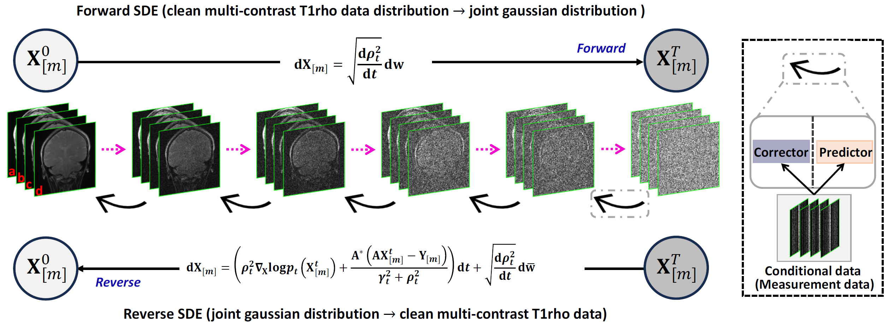

<h1 align="center">J-Score: Joint Distribution Learning with Score-based Diffusion for Accelerating T1ρ Mapping</h1>
<p align="center">
    <a href="https://ieeexplore.ieee.org/document/11152307"></a>
    <a href="https://doi.org/10.1109/TMI.2025.3606660"></a>
</p>

Official code for the paper "[J-Score: Joint Distribution Learning with Score-based Diffusion for Accelerating T1ρ Mapping](https://ieeexplore.ieee.org/document/11152307)", published in TMI 2025.


by Congcong Liu, Yuanyuan Liu, [Chentao Cao](https://scholar.google.com/citations?user=vZPl_oQAAAAJ&hl=en), Jing Cheng, Qingyong Zhu, Tian Zhou, Chen Luo, Yanjie Zhu, Haifeng Wang, [Zhuo-Xu Cui<sup>+</sup>](https://scholar.google.com/citations?user=QZx0xdgAAAAJ&hl=en), and [Dong Liang<sup>+</sup>](https://scholar.google.com/citations?user=3cAJWoIAAAAJ&hl=en)(<sup>+</sup>denotes corresponding author).

### Illustration


### Abstract
T1rho mapping requires acquiring images at multiple spin-lock times (TL), making the scan inherently time-consuming. Existing diffusion-based MRI reconstruction methods typically model each frame independently, failing to exploit the strong correlations among multi-TL acquisitions. In this work, we propose J-Score, a score-based diffusion framework that learns the **joint distribution** of multi-coil k-space data across all TL frames simultaneously. By incorporating coil sensitivity maps and a low-frequency conditioning strategy, J-Score enables stable and accurate reconstruction from heavily undersampled multi-TL measurements. The reverse diffusion is solved with a predictor-corrector sampler, achieving high-quality T1rho maps with improved fidelity in both spatial and temporal dimensions.

## Setup

The following will introduce environment setup, data preparation, and usage instructions.

### Dependencies

Run the following to install a subset of necessary python packages for our code.

```bash
conda env create -f environment.yml
```

> **Note:** If your CUDA version differs from the default, check `freeinstall.sh`, which provides all required packages with explicit version pins.

```bash
bash freeinstall.sh
conda activate jscore
```

## Data Preparation

### T1rho dataset

#### Data format

J-Score expects HDF5 (`.h5`) files. If your sensitivity maps are stored as MATLAB v7.3 `.mat` files, convert them using the provided utility:

```bash
export MAT73_INPUT_FILE=/path/to/csm.mat
export H5_OUTPUT_FILE=/path/to/csm.h5
export MAT73_DATASET_KEY=csm
python data_prepare/save_h5py.py
```

#### Required HDF5 keys

| File | Environment Variable | HDF5 Key | Description |
|------|----------------------|----------|-------------|
| Training k-space | `T1RHO_TRAIN_KSPACE_FILE` | `kspace` | Multi-coil multi-TL k-space |
| Training sensitivity maps | `T1RHO_TRAIN_MAPS_FILE` | `maps` | Coil sensitivity maps |
| Sampling k-space | `T1RHO_SAMPLE_KSPACE_FILE` | `raw` | Undersampled k-space input |
| Sampling sensitivity maps | `T1RHO_SAMPLE_MAPS_FILE` | `csm` | Coil sensitivity maps |

#### Set environment variables

```bash
# For training
export T1RHO_TRAIN_KSPACE_FILE=/path/to/train_kspace.h5
export T1RHO_TRAIN_MAPS_FILE=/path/to/train_maps.h5

# For sampling
export T1RHO_SAMPLE_KSPACE_FILE=/path/to/sample_raw.h5
export T1RHO_SAMPLE_MAPS_FILE=/path/to/sample_csm.h5
export T1RHO_MASK_PATH=/path/to/mask/low_frequency_acs10.mat
```

### Mask Preparation

Pre-generated undersampling masks are provided in `mask/`. The mask filename convention is:

```
mask_type + _acs + acs_size + .mat
```

The code for generating additional masks is in `utils/generate_mask.py`.

## Usage

Train and evaluate models through `main.py`.

```
main.py:
  --config:   Training configuration (path to config file).
  --mode:     <train|sample>: Running mode.
  --workdir:  Working directory (must be set to 'results').
```

* `config` is the path to the config file. Config files are in `configs/` and follow [`ml_collections`](https://github.com/google/ml_collections) format.

  **Config file naming conventions:**

  ```
  configs/
  ├── ve/
  │   └── ncsnpp_continuous.py    # VE-SDE + NCSN++ (T1rho, primary)
  └── vp/
      └── ddpm_continuous.py      # MSSDE + DDPM (reference)
  ```

  * Method: `ve` (VE-SDE) or `vp` (MSSDE)
  * Model: `ncsnpp` or `ddpm`

* `workdir` stores all experiment artifacts (checkpoints, samples, logs) under `results/`.

* `mode` is either `train` or `sample`.

## Quick Start Guide

### Training

Open `configs/ve/ncsnpp_continuous.py` and adjust the key training parameters:

| Parameter | Meaning | Example Value |
|-----------|---------|---------------|
| `training.mask_type` | Conditioning mask type | `low_frequency` |
| `training.acs` | ACS region size (lines) | `10` |
| `training.batch_size` | Batch size (adjust for GPU memory) | `1` |
| `training.epochs` | Training epochs | `500` |

Run training:

```bash
bash train_fastMRI.sh ve
```

Resume from a checkpoint:

```bash
bash train_fastMRI.sh ve 2022_11_04T23_23_58_ncsnpp_vesde_N_1000
```

Checkpoints are saved under:

```
results/<timestamped_run_id>/checkpoints/checkpoint_<step>.pth
```

Monitor training with TensorBoard:

```bash
tensorboard --logdir results/
```

### Sampling

Open `configs/ve/ncsnpp_continuous.py` and set the sampling parameters:

| Parameter | Meaning | Example Value |
|-----------|---------|---------------|
| `sampling.folder` | Run directory name under `results/` | `2022_11_04T23_23_58_ncsnpp_vesde_N_1000` |
| `sampling.ckpt` | Checkpoint step to load | `380` |
| `sampling.mask_type` | Undersampling mask type | `released_mask` |
| `sampling.snr` | SNR weight for Langevin corrector (higher = more noise correction) | `0.458` |
| `sampling.mse` | Predictor score weight | `2` |
| `sampling.corrector_mse` | Corrector score weight | `5` |

Run sampling:

```bash
bash test_fastMRI.sh ve
```

Reconstruction outputs are saved as `.mat` files under `results/<sampling.folder>/`.

### Evaluation

After sampling, compute NMSE, PSNR, and SSIM:

```bash
python evaluation.py \
    --recon_dir results/<sampling.folder> \
    --gt_file /path/to/ground_truth.mat \
    --recon_key recon \
    --gt_key label
```

### Tuning Guidelines

#### Sampling parameter tuning

* If reconstruction shows artifacts → increase `sampling.snr`.
* If reconstruction is blurry or over-smoothed → decrease `sampling.snr`.
* If there is a global brightness offset → adjust `sampling.mse` or `sampling.corrector_mse`.
* For `sampling.snr`, search in steps of 0.05–0.1.
* For `sampling.mse` / `sampling.corrector_mse`, use exponential search: 0.1, 1, 5, 10, ...

## References

If you find the code useful for your research, please consider citing:

```bibtex
@article{liu2025jscore,
  author  = {Liu, Congcong and Liu, Yuanyuan and Cao, Chentao and Cheng, Jing and Zhu, Qingyong and Zhou, Tian and Luo, Chen and Zhu, Yanjie and Wang, Haifeng and Cui, Zhuo-Xu and Liang, Dong},
  journal = {IEEE Transactions on Medical Imaging},
  title   = {J-Score: Joint Distribution Learning with Score-based Diffusion for Accelerating T1rho Mapping},
  year    = {2025},
  doi     = {10.1109/TMI.2025.3606660}
}
```

Our implementation is based on [Score-based SDE](https://github.com/yang-song/score_sde_pytorch) by Dr. Yang Song. We also referenced the [HFS-SDE](https://github.com/Aboriginer/HFS-SDE) codebase by Chentao Cao et al. Thanks for their great works!

## Questions

If you have any questions, please feel free to open an issue or contact the authors.
